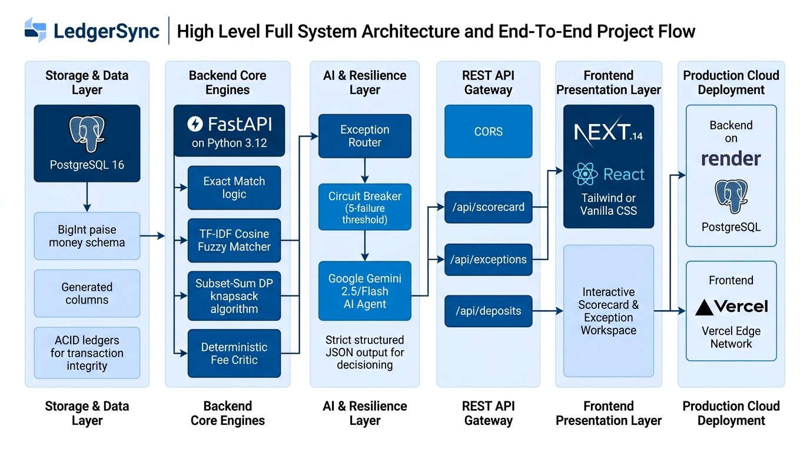
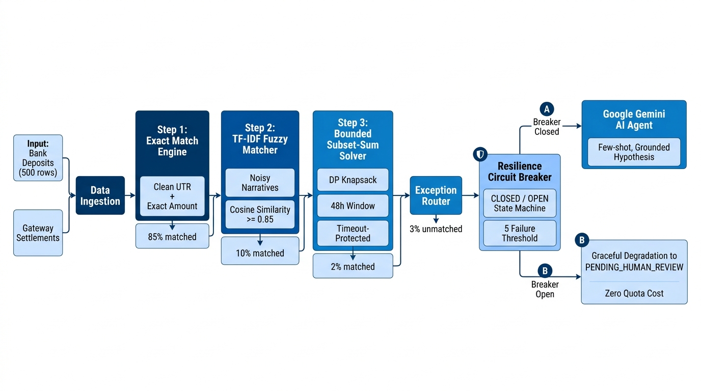
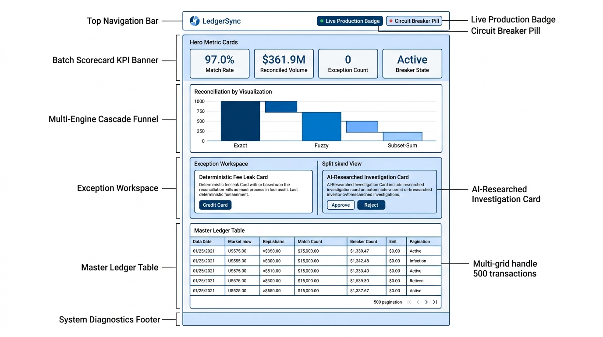
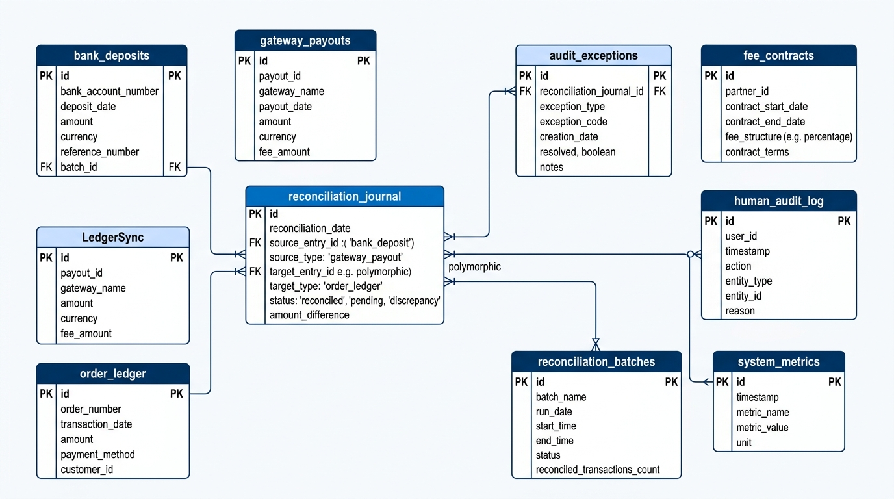

# LedgerSync AI — Automated Financial Reconciliation & Forensic Audit Terminal

**Razorpay Buildathon 2026 — Track 04: AI Finance Controller & Continuous Audit Engine**

[](https://github.com/sahilgaur22/LedgerSync/actions/workflows/ci.yml)
[](https://ledger-sync-blue.vercel.app/)
[](https://ledgersync-backend-v9mr.onrender.com/api/health)

---

## Executive Summary

**LedgerSync** is an automated financial reconciliation and continuous audit engine built for high-volume Indian payment operations (Razorpay, Axis, HDFC). It ingests messy bank settlement feeds, resolves **~97% of transactions deterministically** through a tiered multi-engine cascade (Exact Hash, TF-IDF character n-gram Cosine, and Bounded Dynamic Programming), and strictly restricts AI to forensic exception research. An automated circuit breaker guards the external AI pipeline, guaranteeing graceful degradation to human review with zero operational downtime when LLM services degrade.

---

## Live Deployments & API Endpoints

- **Production Frontend Terminal**: [https://ledger-sync-blue.vercel.app/](https://ledger-sync-blue.vercel.app/)
- **Production Backend API**: [https://ledgersync-backend-v9mr.onrender.com/](https://ledgersync-backend-v9mr.onrender.com/)
- **API Health Check**: [https://ledgersync-backend-v9mr.onrender.com/api/health](https://ledgersync-backend-v9mr.onrender.com/api/health)
- **Live Reconciliation Scorecard**: [https://ledgersync-backend-v9mr.onrender.com/api/scorecard](https://ledgersync-backend-v9mr.onrender.com/api/scorecard)

---

## Evaluation Rubric Codebase Mapping

This section explicitly maps the four judging criteria of Track 04 to their concrete architectural implementations in the codebase.

```
┌─────────────────────────────────────────────────────────────────────────────┐
│                     LEDGERSYNC MULTI-ENGINE RECONCILIATION                   │
├─────────────────────────────────────────────────────────────────────────────┤
│                                                                             │
│   500 Bank Statement Deposits (Intake Feed)                                 │
│        │                                                                    │
│        ▼                                                                    │
│   [ Stage 1: Exact Match Engine ] ──────────────► ~85% Resolved (~425)      │
│        │                                          (Confidence: 1.0000)      │
│        ▼ (~75 Unmatched)                                                    │
│   [ Stage 2: TF-IDF Fuzzy Matcher ] ────────────► ~10% Resolved (~50)       │
│        │                                          (τ >= 0.4000 threshold)   │
│        ▼ (~25 Unmatched)                                                    │
│   [ Stage 3: Bounded Subset-Sum DP ] ───────────►  ~2% Resolved (~10)       │
│        │                                          (200ms bounded knapsack)  │
│        ▼ (15 Unresolved Deposits)                                           │
│   [ Stage 4: Forensic AI Research ] ────────────►  15 AI Researched (~3%)   │
│        │                                          (Grounded Ledger Refs)    │
│        ▼                                                                    │
│   ┌─────────────────────────────────────────────────────────────────────┐   │
│   │ Independent Deterministic Fee Critic: 15 Contract Variances Flagged │   │
│   │ (10 MDR Fee Leaks · 5 GST Statutory Tax Variances · 0% Probabilistic) │   │
│   └─────────────────────────────────────────────────────────────────────┘   │
└─────────────────────────────────────────────────────────────────────────────┘
```

---

## System Architecture & Engineering Diagrams

### 1. End-to-End System Architecture


### 2. Multi-Engine Reconciliation & Resilience Pipeline


### 3. Frontend Terminal Structure & Dual Workspace


### 4. Relational Database Schema (9 Tables)


---

### Pillar 1: Problem Taste & Domain Fidelity

| Requirement | Code Implementation | Architectural Rationale |
| :--- | :--- | :--- |
| **Realistic Settlement Data** | [`backend/app/seed/seeder.py`](backend/app/seed/seeder.py#L36-L236) | Synthetic population of ~10,000 merchant orders bundled into ~500 gateway payouts and 500 bank statement lines, featuring real Indian banking patterns (CMS, NEFT, ACH, IMPS, Razorpay batch tokens). |
| **UTR Obfuscation & Bank Noise** | [`backend/app/seed/seeder.py`](backend/app/seed/seeder.py#L199-L221) | Injects realistic narrative mutations: truncated UTRs, bank clearing prefixes (`ACH-CR-AXIS000192-TXN-CMS-...`), and unslashed strings (`NEFT CR ... SETTL`). |
| **Fee Contract Modeling** | [`backend/app/models/models.py`](backend/app/models/models.py#L61-L67) | Stores merchant contract rules with MDR in basis points (180 bps = 1.80%) and statutory GST (1800 bps = 18.00%). |
| **Dual Card Review Workspace** | [`frontend/components/ExceptionWorkspace.tsx`](frontend/components/ExceptionWorkspace.tsx) | Clean visual distinction between contract math findings (pure math audit) and probabilistic AI research hypotheses (corroborating ledger evidence refs). |

---

### Pillar 2: Build Quality & Engineering Rigor

| Requirement | Code Implementation | Architectural Rationale |
| :--- | :--- | :--- |
| **Integer Paise (BigInt) Precision** | [`backend/app/models/models.py`](backend/app/models/models.py#L22-L58) | All money values stored strictly as `BIGINT` integer paise across PostgreSQL, Pandas, and Python to eliminate IEEE 754 floating-point rounding errors. Tested in [`tests/test_schema_and_seeder.py`](tests/test_schema_and_seeder.py#L23-L33). |
| **Database Generated Columns** | [`backend/alembic/versions/`](backend/alembic/versions/) | `tax_and_fee_lines.variance_paise` and `reconciliation_batches.match_rate` are PostgreSQL `GENERATED ALWAYS AS ... STORED` columns, guaranteeing zero divergence between stored balances and audit queries. |
| **Deterministic Engine Cascade** | [`backend/app/engine/exact.py`](backend/app/engine/exact.py), [`backend/app/engine/fuzzy.py`](backend/app/engine/fuzzy.py), [`backend/app/engine/subset_sum.py`](backend/app/engine/subset_sum.py) | Tiered pipeline cascading from O(1) exact hash match, to character n-gram cosine matching, to bounded dynamic programming. Achieves **~97% automated match rate** across 500 bank deposits. |
| **Bounded Knapsack Solver** | [`backend/app/engine/subset_sum.py`](backend/app/engine/subset_sum.py#L18-L95) | Subset-sum solver bounded to 2-payout combinations within a ±3 day settlement window with a strict 200ms CPU timeout and greedy local search fallback to prevent NP-hard compute exhaustion. |
| **Automated Verification Suite** | [`tests/`](tests/) | 15/15 passing automated test suite covering money precision, engine correctness, threshold metrics, prompt sanitization, circuit breaker state machine, and API endpoints. |
| **Automated CI/CD Pipeline** | [`.github/workflows/ci.yml`](.github/workflows/ci.yml) | Dual-gate GitHub Actions testing frontend (Node 20 / TypeScript / Next.js build) and backend (Python 3.12 / PostgreSQL 16 service container / Alembic / Ruff / Pytest). |

---

### Pillar 3: AI Judgment & Forensic Integrity

| Requirement | Code Implementation | Architectural Rationale |
| :--- | :--- | :--- |
| **Zero-ML Fee Critic Isolation** | [`backend/app/engine/fee_critic.py`](backend/app/engine/fee_critic.py) | **0% ML / LLM involvement**. Contract MDR leaks and GST tax variances are computed via pure integer arithmetic against contract rates. LLMs are never allowed to "guess" contractual math. Tested in [`tests/test_deterministic_engine.py`](tests/test_deterministic_engine.py#L136-L158). |
| **Grounded Ledger Evidence Schema** | [`backend/app/agent/client.py`](backend/app/agent/client.py#L25-L35) | The AI agent is constrained to Pydantic structured output containing strictly grounded evidence fields: `matched_payout_id`, `utr_id`, `delta_hours`, and `forensic_method`. Ungrounded hallucinations are rejected. |
| **Prompt Injection Defense** | [`backend/app/agent/client.py`](backend/app/agent/client.py#L85-L105) | Bank narratives are treated as untrusted user input. Narratives are sanitized with HTML entity escaping (`<` → `&lt;`, `>` → `&gt;`) and enclosed in strictly isolated `<untrusted_narrative>` tags with explicit system boundary instructions. Tested in [`tests/test_ai_agent_and_api.py`](tests/test_ai_agent_and_api.py#L39-L47). |
| **Read-Only Database Access** | [`backend/app/agent/router.py`](backend/app/agent/router.py) | The AI agent operates with strictly read-only queries against candidate payouts. It cannot write to the ledger; resolutions require explicit human auditor approval. |

---

### Pillar 4: Failure Recovery & Production Resilience

| Requirement | Code Implementation | Architectural Rationale |
| :--- | :--- | :--- |
| **Circuit Breaker State Machine** | [`backend/app/core/circuit_breaker.py`](backend/app/core/circuit_breaker.py) | Implements `CLOSED` → `OPEN` → `HALF_OPEN` state transitions. Trips automatically after 5 consecutive external AI service failures with a 60-second recovery timeout. Tested in [`tests/test_ai_agent_and_api.py`](tests/test_ai_agent_and_api.py#L49-L72). |
| **Graceful Degradation Fallback** | [`backend/app/agent/router.py`](backend/app/agent/router.py#L45-L65) | When the circuit breaker is `OPEN`, unresolved deposits bypass LLM invocations entirely and are safely stamped into `PENDING_HUMAN_REVIEW` with `AI_SERVICE_DOWN` audit tags, ensuring zero system crashes. |
| **Human Auditor Action Auditing** | [`backend/app/api/endpoints.py`](backend/app/api/endpoints.py#L295-L380) | Human operator `APPROVE`, `REJECT`, and `OVERRIDE` actions write atomic audit trails to `reconciliation_journal` with operator notes, timestamps, and confidence ratings. |
| **Full Cross-Origin & Cloud Resilience** | [`render.yaml`](render.yaml), [`frontend/app/page.tsx`](frontend/app/page.tsx) | Blueprint-driven deployment on Render (PostgreSQL 16 + FastAPI) and Vercel (Next.js), with CORS handling and environment-decoupled API configuration. |

---

## Known Limitations & Production Roadmap

Engineering maturity means being transparent about design trade-offs:

1. **Multi-Way Payout Combinations**: The current Subset-Sum solver is bounded to 2-payout combinations within a ±3-day settlement window with a 200ms CPU timeout. For N-to-N batch sweeps, an enterprise deployment would implement an asynchronous integer programming solver (e.g., Google OR-Tools) backed by a background Celery/Redis worker queue.
2. **Quota & Embedding Cache**: Operating on the Google Gemini Free Tier requires strict idempotency and exception deduplication. In high-throughput production, the AI router would be fronted by a Redis vector cache of transaction embeddings and provisioned TPM throughput.
3. **Cross-Border FX Revaluation**: The engine is currently optimized for INR with integer paise precision and Indian statutory tax lines (GST). Adding multi-currency settlements and automated FX gain/loss journalization is the next milestone.

---

## Local Development & Setup

### Prerequisites
- Python 3.12+
- Node.js 20+
- PostgreSQL 16+

### 1. Backend Setup
```bash
# Navigate to project root
python -m venv .venv
source .venv/bin/activate  # Or on Windows: .venv\Scripts\activate

# Install dependencies
pip install -r backend/requirements.txt

# Run migrations and seed data
alembic -c backend/alembic.ini upgrade head
python -c "from backend.app.seed.run_seed import seed_database; seed_database()"

# Run tests
pytest -v

# Start FastAPI server
uvicorn backend.app.main:app --host 127.0.0.1 --port 8000 --reload
```

### 2. Frontend Setup
```bash
cd frontend

# Install dependencies
npm install

# Run type check and build
npm run build

# Start Next.js dev server
npm run dev
```
Open [http://localhost:3000](http://localhost:3000) to view the terminal.

---

## Tech Stack
- **Backend**: Python 3.12, FastAPI, SQLAlchemy 2.0, PostgreSQL 16, Alembic, Scikit-Learn (TF-IDF), Google Gemini 3.5 Flash, Pydantic v2.
- **Frontend**: Next.js 14 (App Router), React 18, TypeScript, Tailwind CSS, Lucide React.
- **Infrastructure**: GitHub Actions (CI), Render (PostgreSQL 16 & Web Service), Vercel (Edge Frontend).
